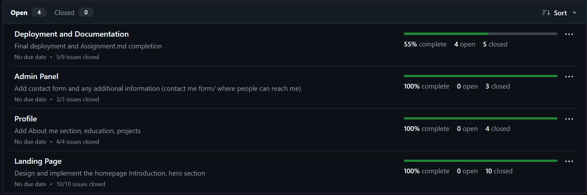
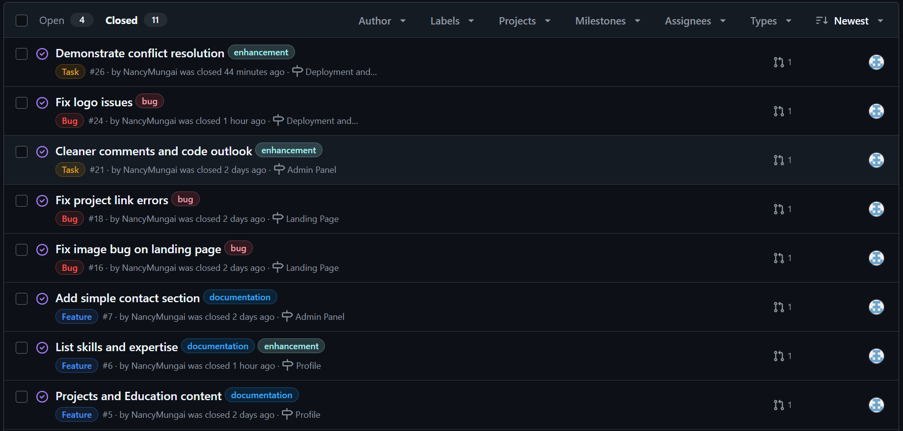
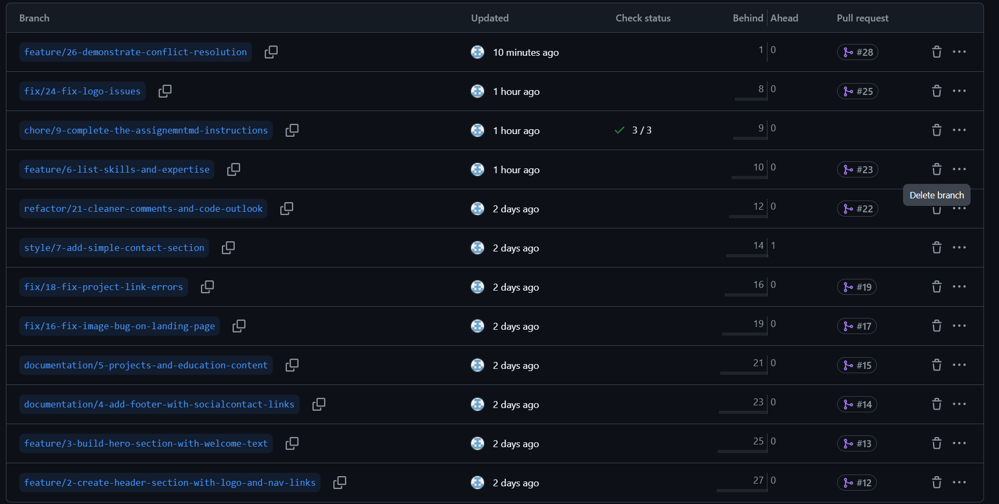
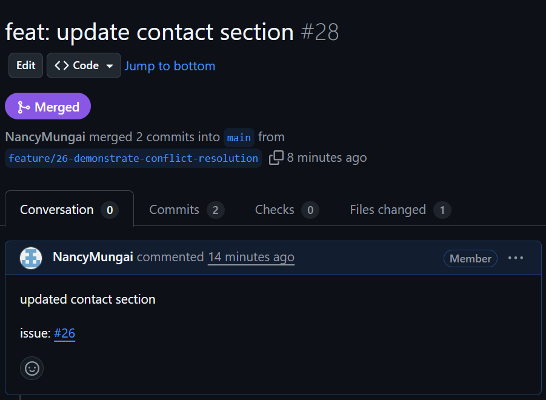
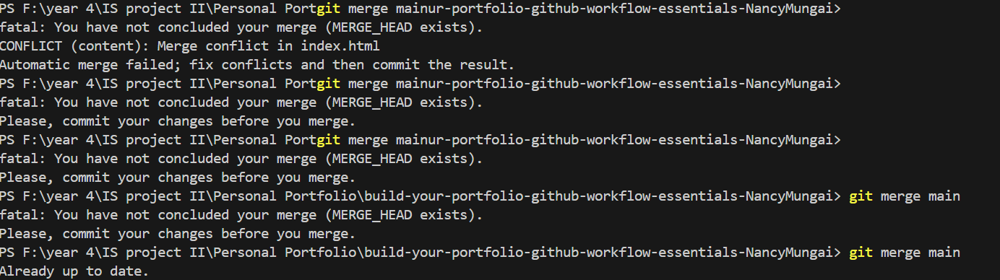
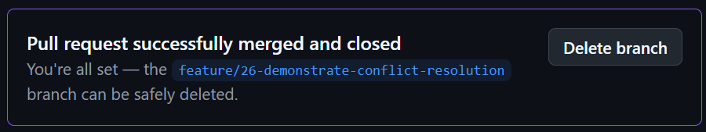

# Personal Portfolio Documentation

## 1. Student Details

- **Full Name**: Mungai Nancy, Wanjiru
- **Admission Number**: 150912
- **GitHub Username**: NancyMungai
- **Email**: nancy.mungai@strathmore.edu

## 2. Deployed Portfolio Link

- **GitHub Pages URL**:  
  https://is-project-4th-year.github.io/build-your-portfolio-github-workflow-essentials-NancyMungai/

## 3. Learnings from the Git Crash Program

Write about **4 things** you expected to learn during the Git crash course.

**🧠 What I Thought I'd Learn vs What I Actually Learned**

**1. Concept: Pull Requests**

`Expectation 👀` : I thought the main thing I would learn was how to make pull requests. I assumed the course would mostly be about requesting code reviews and merging branches.

`Reality 😅`: I ended up learning so much more like branching, conflict resolution, commit types, and team workflows. Honestly, it made my whole GitHub experience much more structured and worthwhile.

`Impact 💡`: I now know how to use pull requests to safely merge features. I also learned easier ways to resolve conflicts and understand when and why they occur. It helped me structure my personal portfolio into small issues and milestones and merge confidently.

**2. Concept: Commit Conventions & Team Collaboration.**

`Expectation 👀` : I didn’t think much about how I named commits I figured any message would do. I also didn’t realize how important structure was for collaboration.

`Reality 😅`: I learned how proper naming conventions such as feat, fix, chore, etc. make commits readable and meaningful, ensuring clarity especially in group settings. 

`Impact 💡`: In my personal portfolio, my commits are now well organized, and even when working alone, I can easily track changes. In a team, this would definitely help others understand what was done and why, and avoid data loss or overlapping edits.

**3. Concept: Branching & Merging**

`Expectation 👀` : I assumed branching was only useful for teams working on massive features. I didn’t think it would apply much to an individual project like my portfolio.

`Reality 😅`: Turns out branching is super useful even for small tasks or bug fixes. I even learned about different types of merges like rebase, which I had never heard of before.

`Impact 💡`: In my personal portforlio I used feature branches for each section, such as About, Hero, Contact, and tested changes in isolation. This gave me more control, helped prevent mistakes, and improved my understanding of code modularity.

**4. Concept: Project Boards**

`Expectation 👀` :  I thought project boards were something only managers or large teams would use, not something relevant for my own work.

`Reality 😅`:
I discovered that GitHub project boards are incredibly helpful. They made it easy to track what’s done, what’s in progress, and what’s still pending. Giving a clear overview of the tasks.

`Impact 💡`: I created a project board for my personal portfolio and used it to organize my issues and milestones. It gave me a clear overview of my tasks and helped me keep track of my progress.
## 4. Screenshots of Key GitHub Features

Include screenshots that demonstrate how you used GitHub to manage your project. For each screenshot, write a short caption explaining what it shows.

### A. Milestones and Issues

These are the milestones I created and their status.

This represents the issues created and how I linked each issue to a milestone to track project phases.

### B. Project Board

Project board showing status of each issue.

### C. Branching

Branch list

### D. Pull Requests

Merged pull request linked to related issue.

### E. Merge Conflict Resolution

 Merge conflict in local terminal 

 Resolved merge conflict in pull request
